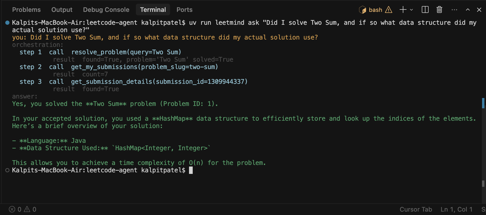
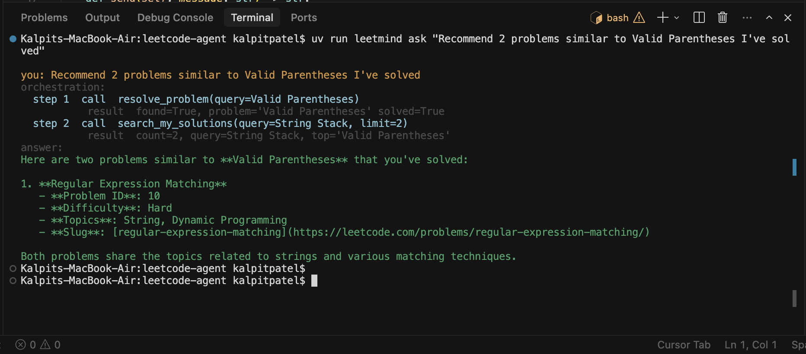
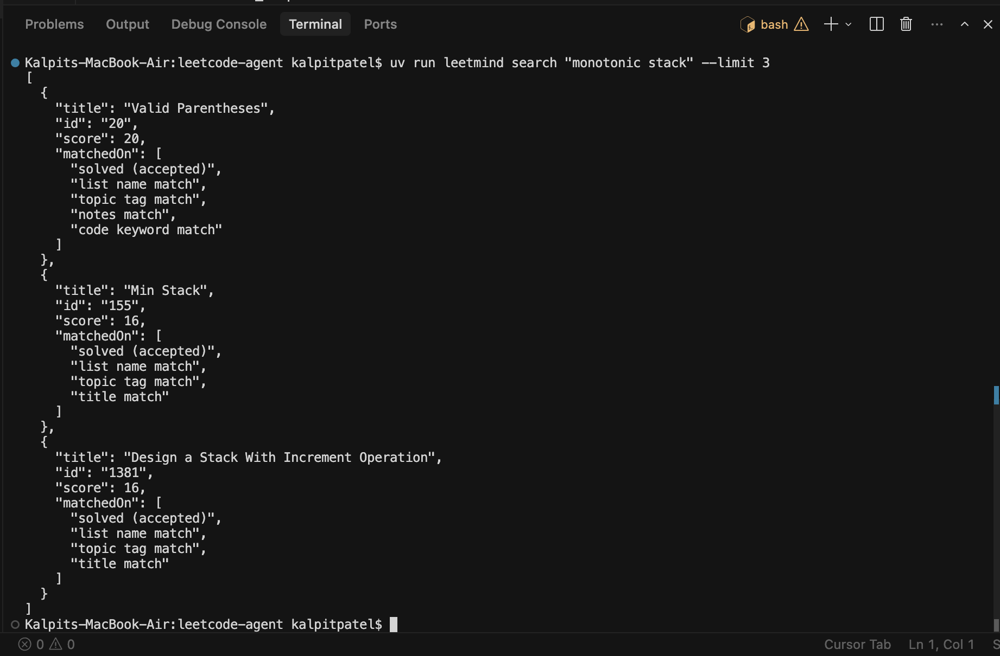

# Leetmind

A personalized **LeetCode AI agent**. Leetmind answers natural-language questions
about **your own** LeetCode profile — which problems you've solved, what technique
your actual submission used, what's in your private lists, and which problems are
similar — by giving an LLM a small set of **tools** instead of raw data access.

> Built to learn **tool calling** and **agentic architecture**. Functional over
> flashy. The interesting part is the orchestration: the agent decides *which*
> tools to call and *in what order* to answer a question.



---

## What makes it "agentic"

Leetmind is a single reasoning agent equipped with six tools. For any question it
plans a sequence of tool calls, reads the (sanitized) results, and decides what to
do next. For example, *"Did I solve Two Sum, and with what data structure?"* needs
three chained calls:

```text
you: Did I solve Two Sum, and if so what data structure did my actual solution use?
orchestration:
  step 1  call  resolve_problem(query=Two Sum)
           result  found=True, problem='Two Sum' solved=True
  step 2  call  get_my_submissions(problem_slug=two-sum)
           result  count=7
  step 3  call  get_submission_details(submission_id=1309944337)
           result  found=True
answer:
Yes, you solved Two Sum (Problem #1). Your solution used a HashMap to store each
number's index, enabling O(1) complement lookups...
```

That live `orchestration:` trace is printed by the CLI (via the Agents SDK run
hooks) so the tool-calling sequence is visible — great for understanding and for
demos.

## Architecture

```
LeetCode Authenticated GraphQL Client   leetmind/leetcode/   (only place secrets live)
        ↓   sanitized dataclasses
Local SQLite Cache                       leetmind/db/
        ↓
Keyword Search Engine (FTS5 + scoring)   leetmind/search/
        ↓
Agent Tools (sanitized JSON only)        leetmind/tools/
        ↓
Agent (OpenAI Agents SDK)                leetmind/agent/
        ↓
CLI Chat Interface                       leetmind/cli/
```

The six tools: `resolve_problem`, `get_my_lists`, `get_problems_in_list`,
`get_my_submissions`, `get_submission_details`, `search_my_solutions`.

See [`docs/architecture.md`](docs/architecture.md) for the full breakdown.

## Security model

The LLM **never** sees your `LEETCODE_SESSION` or CSRF token. Those are read only
inside `leetmind/leetcode/client.py`. Every tool calls LeetCode / SQLite
internally and returns **sanitized JSON** (see [`samples/`](samples/)). Credentials
never enter the prompt, the context, or any tool output.

## Quick start

```bash
# 1. Install deps (creates .venv). Requires Python 3.12+ and uv.
uv sync

# 2. Configure secrets
cp .env.example .env
# edit .env: paste LEETCODE_SESSION, LEETCODE_CSRF, and MODEL_API_KEY (OpenAI)

# 3. Pull your LeetCode data into the local cache
uv run leetmind sync --limit 50      # quick first run; omit --limit for everything

# 4. Ask away
uv run leetmind ask "Have I solved Two Sum?"
uv run leetmind chat                  # interactive
```

> Don't have `uv` on your PATH? `source $HOME/.local/bin/env` (or use a plain
> `python3 -m venv .venv && source .venv/bin/activate && pip install -e .`).

## Commands

| Command | What it does |
| --- | --- |
| `leetmind sync` | Pull problems, lists, submissions into the SQLite cache. Flags: `--limit N`, `--skip-submissions`, `--no-code`. |
| `leetmind status` | Show what's cached and verify the session cookie (no LLM). |
| `leetmind ask "..."` | Ask one question. Shows the tool trace by default (`--quiet` to hide). |
| `leetmind chat` | Interactive multi-turn chat (keeps history). |
| `leetmind search "..."` | Debug: run keyword search directly, bypassing the LLM. |

## Screenshots / demo

Placeholders below — capture the listed command for each. See
**[`docs/demo.md`](docs/demo.md)** for the full copy-paste command list.

#### 1. Solved + technique (3-tool chain)

```bash
uv run leetmind ask "Did I solve Two Sum, and if so what data structure did my actual solution use?"
```

#### 2. Recommend similar problems (resolve → search)

```bash
uv run leetmind ask "Recommend 2 problems similar to Valid Parentheses I've solved"
```

#### 3. Inspect a private list (resolve list slug → fetch members)

```bash
uv run leetmind ask "What are the first 3 problems in my Sliding Window list?"
```

#### 4. The keyword search engine under the hood (no LLM)
The `search_my_solutions` tool is powered by this: FTS5 retrieval re-ranked by
field-weighted scoring, with the matched signals shown for each result.

```bash
uv run leetmind search "monotonic stack" --limit 3
```

## Project layout

```
leetmind/
  leetcode/   GraphQL client, queries, sanitized types  (the only secret-holder)
  db/         SQLite schema, connection, repositories
  sync/       sync_problems / sync_lists / sync_submissions
  search/     FTS5 indexing + custom field-weighted scoring
  tools/      the six agent tools (return sanitized JSON)
  agent/      agent, system prompt, tool registry, trace hooks
  cli/        Typer CLI (sync / status / ask / chat / search)
samples/      example sanitized tool outputs
docs/         architecture.md, demo.md, screenshots/
```

## Tech

Python 3.12+ · uv · Typer · httpx · python-dotenv · SQLite (FTS5) ·
OpenAI Agents SDK (`openai-agents`).
