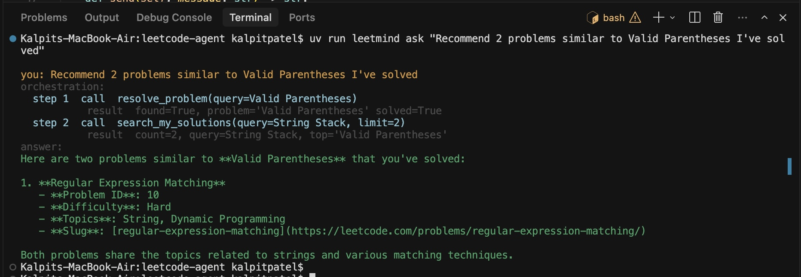
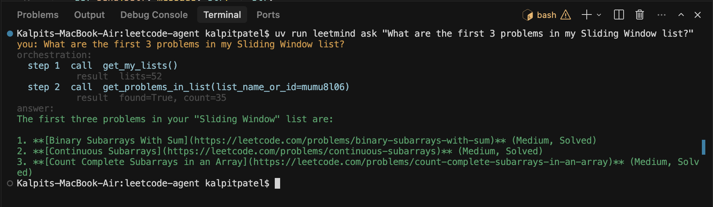
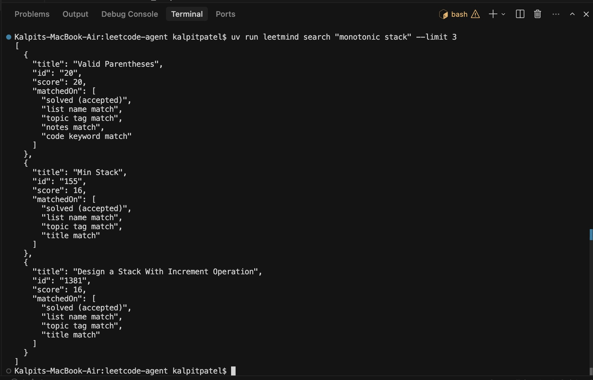

# Leetmind

A personalized **LeetCode AI agent** that answers questions about your own profile: solved status, techniques used in your submissions, private lists, and similar problems. It does this by giving an LLM a small set of **tools** instead of raw database or API access.

Built to explore **tool calling** and **agentic architecture**. The agent decides which tools to call and in what order to answer each question.

<video src="https://github.com/kalpit00/leetmind/raw/main/docs/screenshots/demo.mp4" controls width="100%">
  <a href="https://github.com/kalpit00/leetmind/blob/main/docs/screenshots/demo.mp4">Watch demo: Leetmind answering a question with a visible tool-calling trace</a>
</video>

## What makes it agentic

Leetmind is a single reasoning agent with six tools. For each question it plans a sequence of tool calls, reads sanitized results, and decides what to do next.

Example: _"Did I solve Two Sum, and with what data structure?"_ requires three chained calls:

```text
you: Did I solve Two Sum, and if so what data structure did my actual solution use?
orchestration:
  step 1  call  resolve_problem(query=Two Sum)
           result  found=True, problem='Two Sum' solved=True
  step 2  call  get_my_submissions(problem_slug=two-sum)
           result  count=7
  step 3  call  get_submission_details(submission_id=1309944337)
           result  found=True
answer:
Yes, you solved Two Sum (Problem #1). Your solution used a HashMap ...
```

The CLI prints this `orchestration:` trace live (via OpenAI Agents SDK run hooks), so the tool-calling sequence is visible during demos.

## Architecture

```
LeetCode Authenticated GraphQL Client   leetmind/leetcode/
        ↓   sanitized dataclasses
Local SQLite Cache                       leetmind/db/
        ↓
Keyword Search Engine (FTS5 + scoring)   leetmind/search/
        ↓
Agent Tools (sanitized JSON only)        leetmind/tools/
        ↓
Agent (OpenAI Agents SDK)                leetmind/agent/
        ↓
CLI Chat Interface                       leetmind/cli/
```

**Tools:** `resolve_problem`, `get_my_lists`, `get_problems_in_list`, `get_my_submissions`, `get_submission_details`, `search_my_solutions`

Details: [docs/architecture.md](docs/architecture.md)

## Security

The LLM never sees your `LEETCODE_SESSION` or CSRF token. Those are read only inside `leetmind/leetcode/client.py`. Tools call LeetCode or SQLite internally and return sanitized JSON ([samples/](samples/)). Credentials never enter the prompt or tool output.

## Quick start

Requires Python 3.12+ and [uv](https://docs.astral.sh/uv/).

```bash
uv sync
cp .env.example .env
# Edit .env: LEETCODE_SESSION, LEETCODE_CSRF, MODEL_API_KEY

uv run leetmind sync --limit 50   # omit --limit for a full sync
uv run leetmind ask "Have I solved Two Sum?"
uv run leetmind chat
```

**Without uv on your PATH:**

```bash
source $HOME/.local/bin/env
uv sync
```

**Without uv at all:**

```bash
python3 -m venv .venv
source .venv/bin/activate
pip install -e .
leetmind ask "Have I solved Two Sum?"
```

## Commands

| Command                 | Description                                                                                               |
| ----------------------- | --------------------------------------------------------------------------------------------------------- |
| `leetmind sync`         | Pull problems, lists, and submissions into SQLite. Flags: `--limit N`, `--skip-submissions`, `--no-code`. |
| `leetmind status`       | Show cache stats and verify the session cookie (no LLM).                                                  |
| `leetmind ask "..."`    | Ask one question. Tool trace on by default; use `--quiet` to hide.                                        |
| `leetmind chat`         | Interactive multi-turn chat.                                                                              |
| `leetmind search "..."` | Run keyword search directly (no LLM).                                                                     |

## Demo

Full command list: [docs/demo.md](docs/demo.md)

### 1. Solved + technique (3-tool chain)

See the demo video at the top of this README.

```bash
uv run leetmind ask "Did I solve Two Sum, and if so what data structure did my actual solution use?"
```

### 2. Recommend similar problems



```bash
uv run leetmind ask "Recommend 2 problems similar to Valid Parentheses I've solved"
```

### 3. Inspect a private list



```bash
uv run leetmind ask "What are the first 3 problems in my Sliding Window list?"
```

### 4. Keyword search (no LLM)

The `search_my_solutions` tool uses FTS5 retrieval re-ranked by field-weighted scoring. The CLI `search` command exposes the same engine and shows match reasons.



```bash
uv run leetmind search "monotonic stack" --limit 3
```

## Project layout

```
leetmind/
  leetcode/   GraphQL client, queries, sanitized types
  db/         SQLite schema, connection, repositories
  sync/       sync_problems, sync_lists, sync_submissions
  search/     FTS5 indexing + custom scoring
  tools/      six agent tools (sanitized JSON)
  agent/      agent, system prompt, tool registry, trace hooks
  cli/        Typer CLI
samples/      example sanitized tool outputs
docs/         architecture.md, demo.md, screenshots/
```

## Tech stack

Python 3.12+, uv, Typer, httpx, python-dotenv, SQLite (FTS5), OpenAI Agents SDK (`openai-agents`).
